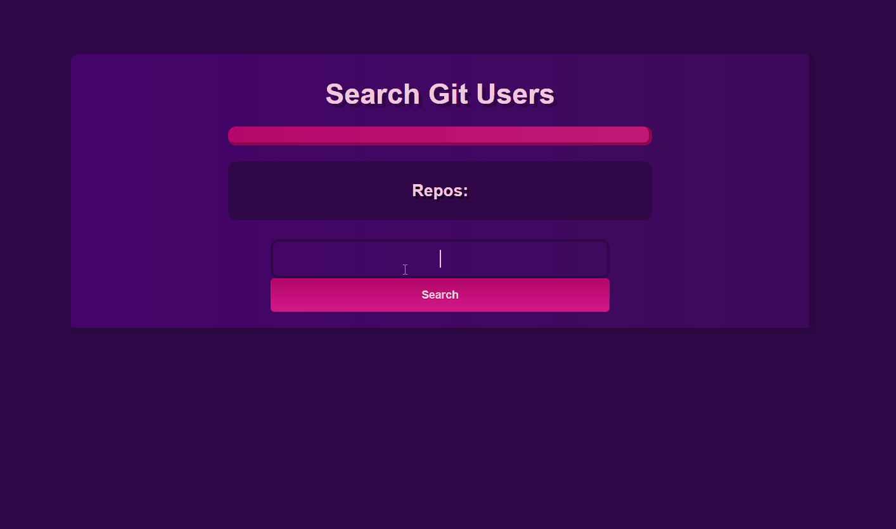

# Github Api

This is a simple excercise on **api consumption** using [axios](https://github.com/axios/axios) - A Promise based HTTP client for the browser and node.js.

## About this project
This project allows you to search a especific github account, based on their user, and it displays on screen the *user's avatar, bio and all their repos with their respective names*.

## Objective
I've built this really simple app as a way to practice my habilities in api consumption using js and the axios library.
